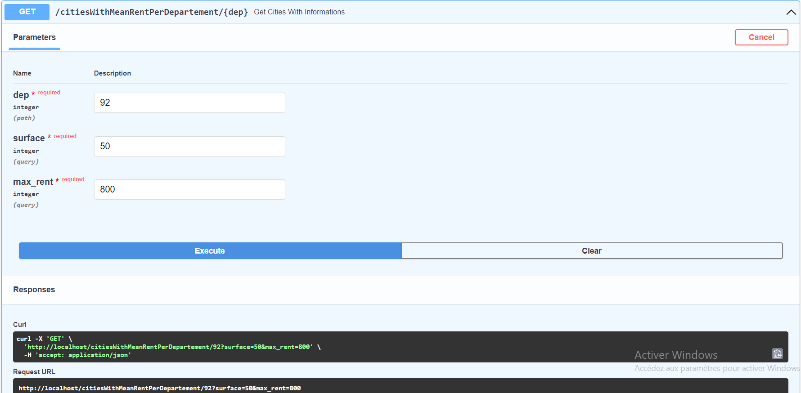
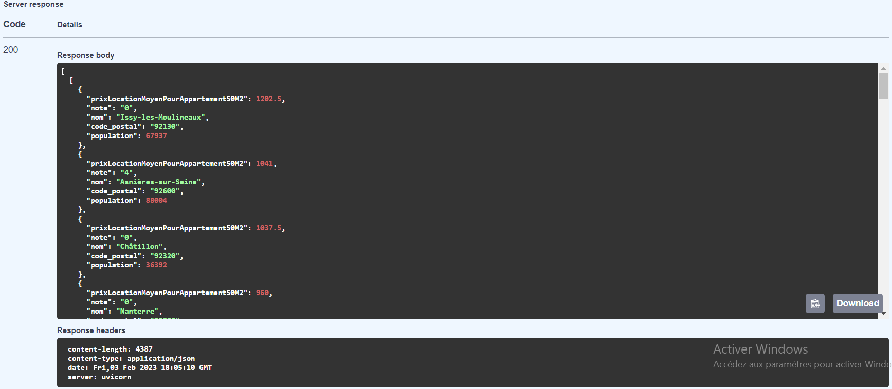

# loyerMoyenParDepartement
Cette API expose les loyers moyens pour une surface donnée par département

On peut faire un appel en passant les params suivants: 
* le code du département: dep
* la surface de M2 souhaitée: surface
* le loyer maximun: max_rent

L'API retourne une liste de toutes la liste des villes pour un département donné

Exemple: 

Req:

Res:

